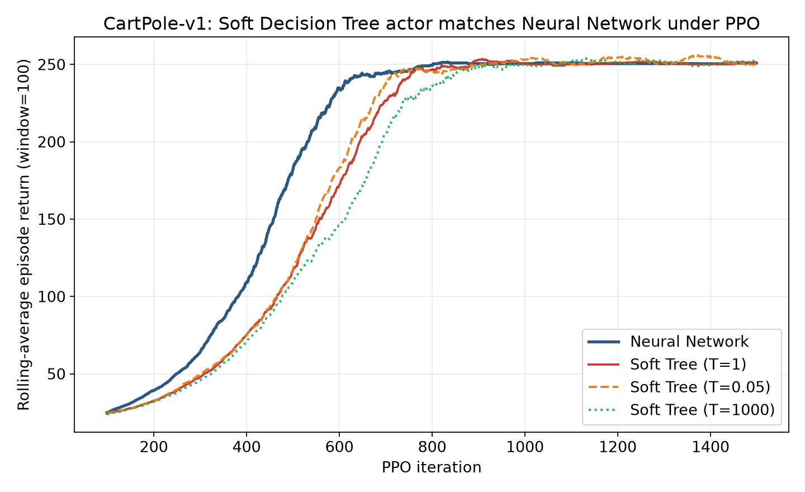

# PPO with a Soft Decision Tree Actor vs. a Neural Network on CartPole

[](https://www.python.org/)
[](https://pytorch.org/)
[](https://pytorch.org/rl/)
[](LICENSE)
[](https://arxiv.org/abs/2604.02528)

Reinforcement-learning study comparing **Proximal Policy Optimization (PPO)** with two policy
representations on the **CartPole-v1** benchmark:

- a standard **Neural Network (NN)** actor, and
- an interpretable **Soft Decision Tree (ST)** actor.

Both actors are trained and evaluated under the same PPO framework, so the question is direct:
*can an interpretable soft-tree policy match a neural-network policy?*

> **Context.** This repository is the control-benchmark validation step of a larger project on
> **interpretable deep reinforcement learning for element-level bridge life-cycle optimization**
> (Moayyedi & Yang, 2026, [arXiv:2604.02528](https://arxiv.org/abs/2604.02528)). CartPole is used
> here because its discrete action space and low-dimensional state closely mirror the
> bridge-management decision problem, making it a clean testbed to confirm that soft-tree actors are
> competitive with neural-network actors *before* deploying them in the custom bridge environment.

---

## Key result

All policies — the neural network and the soft decision tree at three routing "temperatures"
(T = 1, T = 0.05, T = 1000) — converge to essentially the **same** average episode return under PPO.
The neural network learns marginally faster in the early iterations, but the interpretable soft tree
catches up and matches it at convergence.



| Actor                     | Final avg. return* |
| ------------------------- | :----------------: |
| Neural Network            |       250.9        |
| Soft Decision Tree (T = 1)    |     251.2        |
| Soft Decision Tree (T = 0.05) |     249.9        |
| Soft Decision Tree (T = 1000) |     252.1        |

<sub>*Rolling average episode return over the final 100 PPO iterations (window = 100).</sub>

---

## Method in brief

- **PPO** (clipped objective, GAE advantages) drives policy optimization for both actors.
- The **Soft Decision Tree actor** ([`ElementActorSoftTree`](torchrl_bridge.py)) is a differentiable
  tree of depth *d*: each internal node routes an input left/right with probability
  `sigmoid(beta * w.x)`, path probabilities are multiplied down to the leaves, and per-leaf class
  scores are mixed in log-space with `logsumexp` for numerical stability. The routing sharpness
  `beta` acts as an inverse temperature (`beta = 1/T`), interpolating between soft, probabilistic
  routing and hard, axis-/oblique-split decisions.
- The **Neural Network actor** ([`ElementActorNet`](torchrl_bridge.py)) is a standard MLP with ELU
  activations, used as the baseline.
- A shared MLP **critic** ([`ValueNet`](torchrl_bridge.py)) estimates state values for GAE.


```

Tested with Python 3.10.

---

## Usage

Experiment settings are centralized in [`test_constants_carpol.py`](test_constants_carpol.py)
(actor type, tree depth/`beta`, PPO hyper-parameters, run selection). Edit that file, then run the
scripts below.

**1. Train** — set `actor_model = 'nn'` or `'st'` in `test_constants_carpol.py`, then:

```bash
python ele_ppo_training.py
```

A new run folder is written to `assets/<timestamp>_<nn|st>/` with the trained actor and logs.

**2. Evaluate** a saved actor over many episodes (set `ELE_ACTOR_VERSION` to the run folder):

```bash
python ele_exp_actor.py
```

**3. Plot** the learning curves and NN-vs-ST comparison (set `ELE_ACTOR_VERSION_nn` / `_st`):

```bash
python plt_nn_st.py
```

---

## License

Released under the [MIT License](LICENSE).
